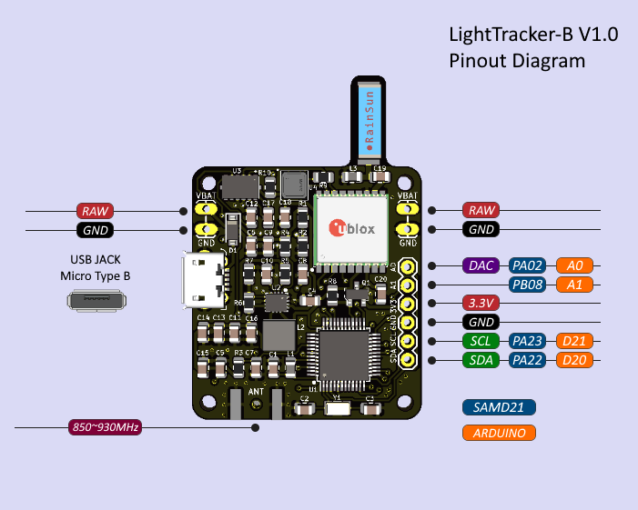
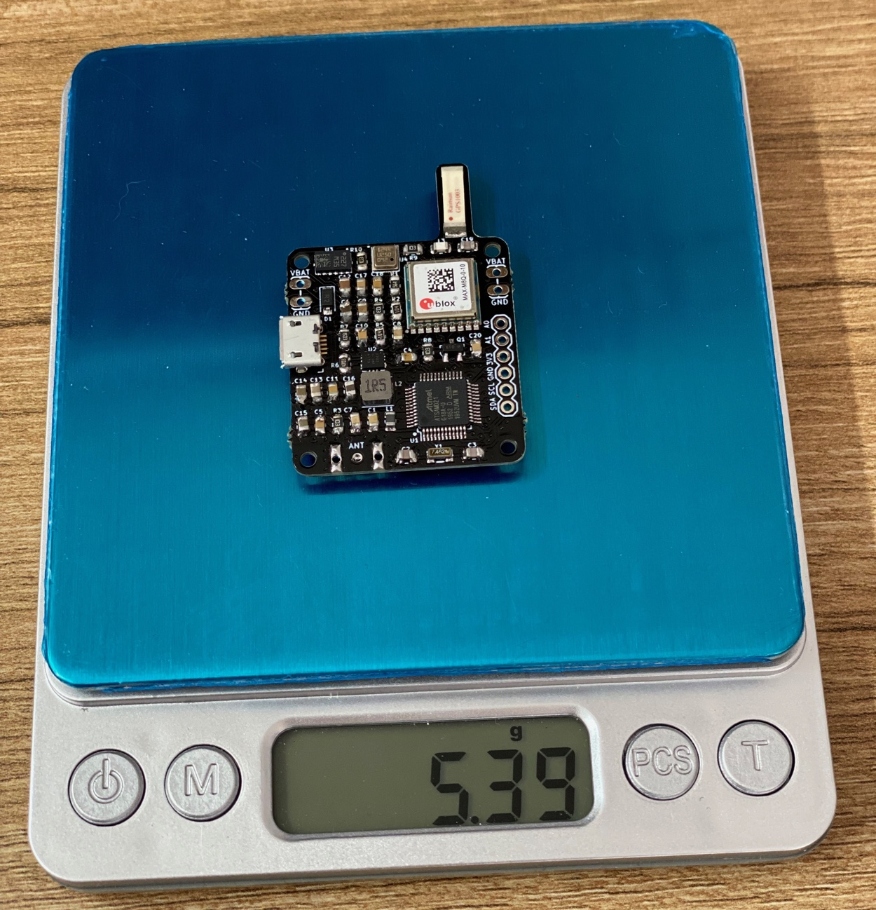

# LightTracker

LightTracker is one of the most affordable, smallest, lightest, powerful and open source LoRa and LoRaWAN trackers available. It makes tracking pico balloons, weather balloons, model rockets, RC aircraft, and anything else that flies simple and easy. 
It is able to report location, altitude, temperature and pressure to the internet (LoRaWAN networks such as Helium and TTN) or direct to another LoRa radio module with a solar panel/super capacitors or just 3xAAA batteries. 
Because LightTracker is open source you can add your own custom sensors via I2C pins.

LightTracker is available on https://shop.qrp-labs.com/lighttracker for order.

**Important :** LightTracker uses unlicensed ISM radio bands which does not require any license to operate. So everone can use LoRa & LoRaWAN modules.

## Basic Features

- **Software** : Open Source
- **Weight** : 5.4 grams
- **Dimensions** : 32 mm x 47 mm
- **IDE** : Arduino
- **Platform** : ARM Cortex-M0 (Arduino M0)
- **CPU** : ATSAMD21G18
- **Flash** : 256 kB
- **Ram** : 32 kB
- **Operating Frequency** : 48 Mhz
- **Operating Voltage** : 3.3 Volt
- **Input Voltage** : 2.7 (min) - 16 (max) Volt via usb or VBat pin
- **Sensor** : BMP180 (pressure and temperature), LSM303DLHC (3D Compass and Accelerometer)
- **Power Consumption (Sleep)** : ~1 mA
- **Power Consumption** : ~7 mA
- **LoRa Radio Module** : [EBYTE E22-900M22S](https://www.ebyte.com/en/product-view-news.aspx?id=437) (SX1262)
- **LoRa Operating Frequency** : 850~930MHz (configurable by code)
- **LoRa Max Power** : 22dBm (configurable by code)
- **LoRa Power Consumption (TX)** : ~110 mA (22dBm)
- **GPS** : Ublox MAX-M8Q (GPS-GLONASS)
- **GPS Antenna Gain** : 4.3 dBi
- **Extended Pins** : I2C, 2x Analog, 1x DAC

## Configuration

To programme LightTracker, all you need is a micro usb (B type) cable, a few installations and configurations.

### 1.Install Arduino IDE

Download and install [Arduino IDE](https://www.arduino.cc/en/Main/Software). If you have already installed Arduino, please check for updates. Its version should be v1.8.13 or newer.

### 2.Configure Board

- Open the **Tools > Board > Boards Manager...** menu item as follows:

- Type "Arduino SAMD" in the search bar until you see the **Arduino SAMD Boards (32-Bits Arm Cortex-M0+)** entry and click on it.

- Click **Install** .
- After installation is complete, close the **Boards Manager** window.
- Open the **Tools > Board** menu item and select **Arduino SAMD Boards (32-Bits Arm Cortex-M0+) -> Arduino M0** from the the list as follows:

### 3.Copy Libraries & Compile Source Code 

You are almost ready to programme LightTracker :)

- First download the repository to your computer using green "[Code -> Download ZIP](https://github.com/lightaprs/LightTracker-1.0/archive/refs/heads/main.zip)" button and extract it.
- You will see more then one Arduino projects optimized for different use cases. For example if you are planning to use LightTracker for a pico balloon project, then use "[lorawan-otaa-pico-balloon-tracker](lorawan-otaa-pico-balloon-tracker)" folder or if you want to track your assets, vehicles, etc. then use "[lorawan-otaa-asset-tracker](lorawan-otaa-asset-tracker)" folder.
- You will also notice some folders in the "libraries" folder. You have to copy these folders (libraries) into your Arduino libraries folder on your computer. Path to your Arduino libraries:

  **Windows** : This PC\Documents\Arduino\libraries\
  
  **Mac** : /Users/\<username\>/Documents/Arduino/libraries/

- Copy all of them into your Arduino libraries folder as follows:

- Then open the regarding sketch file (*.ino) with Arduino IDE and change your settings as described in Wiki pages and save it.
- Click **Verify** 

### 4.Upload

- First attach an antenna to your tracker as if described in [Antenna Guide](https://github.com/lightaprs/LightTracker-1.0/wiki/Antenna-Guide) LoRa radio module may be damaged if operated without attaching an antenna, since power has nowhere to go. 
- Connect LightTracker to your computer with micro USB cable. 
- IYou should see a COM port under **Tools->Port** menu item. Select that port. 

- Click **Upload**
- Your tracker is ready to launch :)

## Wiki

### General

* **[F.A.Q.](https://github.com/lightaprs/LightTracker-1.0/wiki/F.A.Q.)**
* **[Antenna Guide](https://github.com/lightaprs/LightTracker-1.0/wiki/Antenna-Guide)**
* **[Tips & Tricks for Pico Balloons](https://github.com/lightaprs/LightTracker-1.0/wiki/Tips-&-Tricks-for-Pico-Balloons)**
* **[Supported Protocols and Digital Modes](https://github.com/lightaprs/LightTracker-1.0/wiki/Supported-Protocols-and-Digital-Modes)**

### LoRaWAN

* **[Adding Device on Helium Console](https://github.com/lightaprs/LightTracker-1.0/wiki/Adding-Device-on-Helium-Console)**
* **[Cayenne myDevices Integration with Helium Console](https://github.com/lightaprs/LightTracker-1.0/wiki/Cayenne-myDevices-Integration-with-Helium-Console)**
* **[Adding Helium Device on Cayenne myDevices](https://github.com/lightaprs/LightTracker-1.0/wiki/Adding-Helium-Device-on-Cayenne-myDevices)**
* **[How to Customize Cayenne Dashboard](https://github.com/lightaprs/LightTracker-1.0/wiki/How-to-Customize-Cayenne-Dashboard)**
